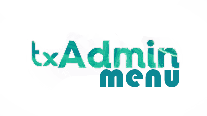

	<h1 align="center">
		txAdmin Menu (in-game)
	</h1>
	

		
	

	<h4 align="center">
		Join our Discord Server: &nbsp; <a href="https://discord.gg/f3TsfvD"></img></a>
	</h4>
	

		This FiveM script doesnt use a framework, and it <b>implements</b> the <b>txAdmin</b> panel in game with the command `/admin`
	

 

# Permission Setup
- To allow certain players to use the menu, add either of the following`to your server.cfg after `ensure txadminmenu`:
	- `add_ace identifier.steam:steamidhere "txadmin.menu.perm" allow`
	- `add_ace identifier.rockstar:licensehere "txadmin.menu.perm" allow`
		- To find Steam ID's use ([VACBanned](http://www.vacbanned.com/))
	- Action logging
	- Brute-force protection
- Discord Integration:

# Remember to change the config.lua, add your txAdmin link! (No it cant be localhost)

Also have in mind you cant use the FiveM login as they reject the iframe request.

To have the latest features always make sure you are using the LATEST (not latest recommended nor optional) version of FXServer artifacts.

No, i did not make txAdmin
# txAdmin is mantained and created by Tabarra, big props to you buddy https://github.com/tabarra/txAdmin

# When using some features that require inputs, u need to alt tab sometimes because the txAdmin popups are made in JS, so it creates an external window.
